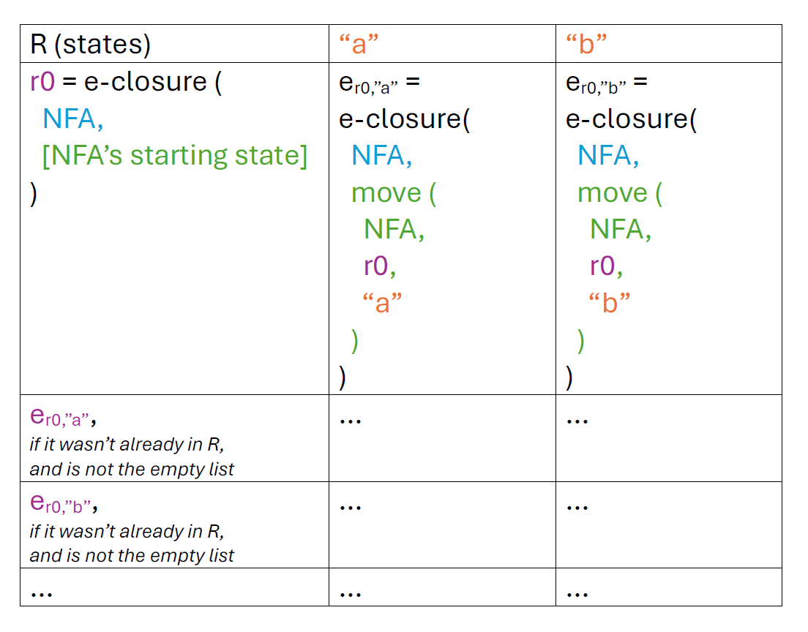

# Exam 1 Review Session
## PL Concepts and OCaml Basics (15 mins)
[Zoya's Notes](https://github.com/user-attachments/files/17236379/PLConceptsOCamlBasicsReview1.pdf)
* Syntax: what a program looks like
* Semantics: what a program means (what it computes)
  * Same syntax could have different meanings for different languages
  * Formal semantics–mathematical definition, such as operational semantics
* Paradigm
  * Fundamental differences
    * Recursion vs Looping
    * Mutation vs Functional Update
    * Manual vs Automatic Memory Management
  * Scripting/Dynamic
    * Higher-layer abstractions
  * Implementation
    * Compilation vs Interpretation
      * Compiler: source program translated to another language, often machine code, then executed (gcc, javac)
      * Interpreter: executes source program as is (more on this later in the semester)
  * Functional vs Imperative
    * Functional
      * Higher level of abstraction

#### OCaml Specific
  * Ocaml is a compiled and bootstrapped language
  * Implicitly typed --> the compiler infers the type of your variables and values at compile time
  * Statically typed --> once the type of a variable is inferred, the variable must abide by the type throughout its scope (type enforcement)
  * Primitive built-in data types
     * int, float, char, string, bool, and unit
     * Composite data types include tuples, lists, option, and variants
  * Arithmetic operators in OCaml are not overloaded --> you can use +, -, *, / on two ints but not on floats
  * tuples - heterogeneous, can have different types, can vary in length
  * lists - homogeneous, can only have same times, can vary in length
   * `::` vs `@` -> `element :: [list of the type of the element]` vs `['a] @ ['a]`
   * There are also no statements in OCaml, everything is an expression, all expressions have values (expressions get evaluated to values), and all values have types. Even functions are expressions and those have their own types!!
  * Records vs Variants
   * Records and variants are both user defined types
    * Records generally used when for description
    * Variants generally used for polymorphism
#### More PL Concepts
 * Currying - transformation of a function that takes in multiple arguments a sequence of single argument functions -> `let f a b = a + b in let g = f 5 in g 5;;` evaluates to 10
 * Shadowing - a variable within a scope has the same name as a variable in the outer scope, outer variable gets shadowed by inner variable (ex. let x = 5 in let x = 4 in x evaluates to 4)
 * Side effects - any observable effect besides returning a result (printing, file input, exceptions)

## OCaml Data and Typing (20 mins)
#### Typing
* Type System - How data is treated and what you can do with certain pieces of data. 
* Type Checking - The process of determining what a piece of data’s type is.
* Type Inference -  How the language will infer the types of the data

#### Expressions & Values
* In OCaml, almost everything is an expression.
* Expressions evaluate to values.
* All values are expressions, but not all expressions are values.
* All expressions also have a (data) type

Variables types are determined by the operations or syntax of the expression. <br>
Examples:
* Bool -> `&&, ||, not`
* Int -> `+, -, *, mod, /,...`
* Float -> `+., -., *., mod., /.,...`
* String -> `^`

And many more! <br>
Some operators work on many different types.  
* `<=`  The output will always be of type bool.   
#### Generics
* `'a` is a generic type can be anything, it's type is unknown. 
* When the type cannot be determined by inferencing a generic type is used. 
* Multiple types in an expression can be generic. 
    ```
    ('a -> 'b) -> 'a -> 'b -> bool
    fun f x y -> (f x) = y
    ```
### Pattern Matching Types
* Pattern matching allows for inputs to be broken down and matched based on their type.
* Pattern matching can happen in a `match` statement or by using a `let` statement.
* Matching can allow for easier manipulation of data
    ```
    let pat_mat lst =
    match lst with
    |[] -> ([],0)
    |h::t -> (t, h+1)

    let x = pat_mat [1;2;3]
    let (l,v) = x
    ```
  In this example, we pattern match the list input with a `match` to determine what to return.
  We also use the `let` expression to match the tuple returned.
#### Typing from Expression
Using steps to breakdown the expression is useful for determining types. <br>
Follow the steps with this expression: 
`fun a b c d -> if c || d then b *. b else if c then b else a`
* **Find the number of inputs.** 
    - There are 4 inputs
    - `(?->?->?->?->?)`
* **Follow the expression to find variable types.** 
    - `c` and `d` use `||` so they must be type bool. `b` uses `*.` so it must be type float. 
    - `(?->float->bool->bool->?)`
* **Use syntax rules to infer more types.**
    - if-statements need matching return types for then and else. Since `b` is type float `a` must be type float as well.
    - `(float->float->bool->bool->?)`
* **Find final return type.**
    - Trace through the expression to find the type of what is returned. Here it would be a float returned from the if-statement.
    - `(float->float->bool->bool->float)`
#### Expression from Type
Similarly, using steps to form an expression from a type is useful. <br>
Follow the steps with this type:
 `('a -> 'b) -> 'a -> 'b -> bool`
* **Find the number of inputs**
     - There are 4 types total so 3 of them are inputs
     - `fun x y z -> ?`
* **Try to make expressions for each of the inputs separately**
    - `x` is a function taking a `'a` and returning a `'b` . `y` is type `'a` so the expression `x y` would give the correct type. 
    - `z` is type `'b` so the result of `x y` would be the same type. 
    - `fun x y z -> (x y) ? z`
* **Make the expressions fit the return type**
    - Using bool operator `=` the type will be bool.
    - `fun x y z -> (x y) = z`
### Practice
* ``fun b d c a -> ((not d) || (d && d)) || a -. b = if c then b else a``
* ``fun a b c d e -> (e :: d, c a b)``
* ``fun a b c d e f g -> g > f || if e < d then not c else b > a``
* ``(int -> bool) -> int -> bool list``
* ``('a list -> 'b) -> 'a -> 'b -> 'a -> 'b``
* ``('a -> 'a list) -> ('a -> 'a) -> 'a -> 'a * 'b list -> 'a``

---
### Additional Resources
* [Discussion](https://github.com/cmsc330fall24/fall2024/blob/main/discussions/discussion2.md)
* [Expression to Type](https://nmittu.github.io/330-problem-generator/type_of_expr.html)
* [Type to Expression](https://nmittu.github.io/330-problem-generator/expr_of_type.html)

## Higher Order Functions (25 mins)

 * HOFs take one or more functions as arguments and/or return a function as its result
 * map and fold are two common examples
 * map is a structure preserving operation - you can only apply the function parameter to the values inside the structure you are mapping over
 * fold replaces the constructor(s) of a type with the corresponding function argument
 * fold_left goes from left to right and fold_right goes from right to left
 * ``List.fold_left (fun a x -> "(" ^ a ^ "+" ^ x ^ ")") "0" ["1";"2";"3"] = "(((0+1)+2)+3)"``
 * ``List.fold_right (fun x a -> "(" ^ x ^ "+" ^ a ^ ")") ["1";"2";"3"] "0" = "(1+(2+(3+0)))"``
 * ``List.fold_left (fun a x -> "(" ^ x ^ "::" ^ a ^ ")") "[]" ["1";"2";"3"] = "(3::(2::(1::[])))"``
 * ``List.fold_right (fun x a -> "(" ^ x ^ "::" ^ a ^ ")") ["1";"2";"3"] "[]" = (1::(2::(3::[])))``

## Imperative OCaml (15 mins)
#### Imperative vs Functional
  * Imperative - procedural, where building blocks are procedures and statements
  * Functional
    * immutability
      * a state (e.g. variable) cannot be modified after it's created
      * any "updates" result from creating a new state altogether
      * ex. inserting into a tree becomes creating a new tree with the value you want to insert
    * Higher-order
      * Functions are passed as arguments and/or returned as results
    * OCaml
      * pattern matching, module system, type inference (compile-time type checking)

## Property Based Testing (20 mins)

* The idea that we can test code based on properties they must uphold rather than specific inputs. 
* Example: What are some properties of a function that is meant to reverse a list? <details><summary>properties</summary>
  - Length of the reversed list = length of original list
  - Reversing the list twice will result in the original list
  - The set of elements in the reversed list should equal the set of elements in the original list
  - etc.
</details>

* When given questions regarding PBT, there are 3 aspects that we must consider: 
  - the validity of the **property itself** in describing what the function is supposed to do (the correct implementation of the function would uphold the property)
  - the validity of the **implementation** of the property (implementation of property represents property)
  - whether the implementation of the **function** upholds the property (the code that may or may not be buggy will always return true when tested against the property)

* These are mostly independent of each other! Consider we are given 4 elements:
  - The property `p`
  - The goal of a function `f` (what `f` is supposed to do)
  - The implementation of `f`, which we can call `I(f)` (the actual code written in an attempt to obtain `f` -> may or may not be buggy)
  - The implementation of `p`, which we can call `I(p)` 

* When asked about the validity of the property, we only consider `p` and `f`
* When asked about the validity of the implementation of the property, we only consider whether `I(p)` matches `p`
* When asked whether the implementation of the code upholds the property (or will the property "catch bugs"), we only consider how `p` correlates to `I(f)`

**Example Problem:**

Recall the `count_occ` function from project 1: it is supposed to take in a `lst` and `target` and return how many elements in `lst` are equal to `target`. (This is the goal of the function, `f`, from above)

Below is an implementation (`I(f)`) of `count_occ`:

```ocaml
let count_occ lst target = List.fold_left (fun x y -> if y = target then y + 1 else x) 0 lst;;
```

The property (`p`) we have identified is:  the result of count_occ will always be less than or equal to the length of the list.

Our implemenation of `p` (`I(p)`) is: `count_occ lst target <= List.length lst` 

- Is the property `p` valid?
- Is the implementation of the property `p` correct?
- Does the implementation of `count_occ` maintain property `p`?

## Regular Expressions (25 mins)
* A pattern that describes a set of strings
* Defines a regular language, which can be created from a finite state machine.
* Creating regular expressions
    - `(ab)` -> a **and** b
    - `(a|b)` -> a **or** b
    - `[abc]` -> a **or** b **or** c
    - `[^abc]` -> anything except a, b, c
    - `[a-z]` -> all lowercase letters
    - `[A-Z]` -> all uppercase letters
    - `[0-9]` -> every digit from 0 to 9
        * Observe, `[r1-r2]` is a range specification <details><summary><b>What does [A-z] match?</b></summary> All characters with ASCII codes between A and z (including [, \, ], ^, _, and `)
</details>

- `(cs|ece)` -> capture "cs" **or** "ece"<details><summary><b>What if we did "[cs|ece]"?</b></summary> Will capture "c", "s", "|", or "e"
</details>
      
* Some Regex operators
    -  `*` -> zero or more repetitions of the preceding character or group
    -  `+` -> one or more repetitions of the preceding character or group
    -  `?` -> zero or one repetitions of the preceding character or group
    -  `.` ->  any character
    -  `{n}` -> exactly n repetitions of the preceding character or group
    -  `{m, n}` -> at least m and at most n repetitions of the preceding character or group
    -  `{n,}` -> at least n repetitions of the preceding character or group}

    -  `\s` -> matches to any whitespace
    -  `\d` -> matches to any singular numeric character. Equivalent to `[0-9]`
    -  `\w` -> matches to any alphanumeric character including underscore. Equivalent to `[A-Za-z0-9_]`

- Remember to escape special characters
    -  Ex. `\(`,  `\)`, `\.`, `\?`, `\+`, `\/`, `\*`, etc.

* Some examples
  * Which of these strings match the following regular expression?
    `^[A-Z]*[a-z]+\s?.[0-9]+$`
    * Cmsc:330
    * CMSC.330
    * cliff 987
    * anwar:00001a
    * alan 3
    <details><summary><b>Answer:</b></summary> 
    Only Cmsc:330, cliff 987, and alan 3
</details>

  *  Write a regular expression that accepts `id: XXX-XX-XXXX codename: <codename>`, where each `X` represents a digit and `<codename>` is a string **beginning with an uppercase letter** that may have additional uppercase **and/or** lowercase letters after it.
   
     For example, the following strings should be accepted:    
       - id: 669-98-3600 codename: Watch
       - id: 123-45-6789 codename: McGregor
       - id: 972-35-6200 codename: Minsi
        
     The following strings should be rejected:        
       - id: 123456789 codename: Wrong
       - id: 987-65-4321 codename: nope
       - id: 271-82-8182 codename: Alan3
       <details><summary><b>Answer:</b></summary> 
        ^id: [0-9]{3}-[0-9]{2}-[0-9]{4} codename: [A-Z][A-Za-z]*$</details>

  * Write a regex that describes a subset of valid UMD emails. Emails take the form of a user’s directory ID followed by the @ symbol, followed by one of the following domain names: cs.umd.edu, terpmail.umd.edu, or just umd.edu.
    
     Additional constraints: 
       - A user’s directory ID can be length 1 to length 8 consisting of only alphanumeric (both upper and lowercase) characters.
       - A user’s directory ID may not start with an uppercase letter.
       - A user's directory ID must end with a digit.

       <details><summary><b>Answer:</b></summary> 
        ^([a-z0-9][A-Za-z0-9]{0,6})?[0-9]@((cs\.|terpmail\.)?umd\.edu)$</details>

  * Write a regex that describes a subset of valid mathematical expressions using the basic operations `+ - * /` and positive integers. Our expressions will begin with a positive integer, and may alternate between operations and positive integers before finally ending with a positive integer. Our expressions may also begin and end with matching parenthesis `(` `)`.

    For example, the following strings should be accepted:    
       - 1
       - 12*2+3/44
       - (100+2-3/4+5)
       - 0003+0102
        
     The following strings should be rejected:        
       - 1+
       - +4*4
       - (1+100/2
       - 1++32

       <details><summary><b>Answer:</b></summary> 
        ^[0-9]+([\-/+*][0-9]+)*|\([0-9]+([\-/+*][0-9]+)*\)$</details>
        
  * Write a regex that describes a set of numbers in scientific notation. There must be single non-zero digit before the decimal place, and there must be at least 1 digit after the decimal place. Following the digits, we must have "e" and then either a positive or negative integer exponent indicated by a preceeding `+` and `-`, respectively.

    For example, the following strings should be accepted:    
       - 6.22e-23
       - 5.5e-10
       - 3.141592658979e+1
       - 1.000000e+0000
        
     The following strings should be rejected:        
       - 0
       - 0.5e-23 (begins with zero)
       - 1e+10 (no decimal point)
       - 1.0 (no exponent)

       <details><summary><b>Answer:</b></summary> 
        ^[1-9]\.[0-9]+e(\+|-)[0-9]+$</details>

  * Write a regex that matches all integers from 0 to 1 million, inclusive. The integer should not have leading zeros, unless it is just 0.

    For example, the following strings should be accepted:    
       - 0
       - 999999
       - 1000000
        
     The following strings should be rejected:        
       - 1000001
       - 1023509870

       <details><summary><b>Answer:</b></summary> 
        ^0|1000000|[1-9][0-9]{0,5}$</details>

* Regular Expressions in OCaml      
  * You need to include the re library. (https://ocaml.org/p/re/1.10.4/doc/Re/index.html)
    ```
    #require "re" (* only in utop *)
    let comp_re = Re.compile (Re.Posix.re "I am ([0-9]+) years old") in 
    let matched = Re.exec comp_re "I am 23 years old" in 
    print_string ("Age: " ^ (Re.Group.get matched 1))
    ```
## Finite State Machines, NFA-DFA (25 mins) 

### What are FSMs?
1) A **finite-state machine** (FSM) or finite-state automata (FSA) is a **model** of certain types of computation. The machine can **be in exactly one "state"** at a time, and **can change** which state it's on **when it recieves input**.
2) FSMs are considered a subset of pushdown automata, which are themselves a subset of turing machines. Turing machines are capable of modeling any computer algorithm - FSMs can only model some.
3) FSMs can be represented by a 5-element tuple:
    - **Set** of all **possible states**
    - A **starting state** — There can be only 1 starting state
    - **Set** of **final or accepting states**
    - **Set** of **transitions** — (initial_state, letter from alphabet, ending_state)
    - **Alphabet** — set of all symbols that representing valid transitions

### FSMs and Regex
- Every regular expression (and in fact, **all regular languages**) **can be represented as FSMs**, and vice versa.
  - A string accepted by the language taken as input would put the machine into a final (accepting) state.
  - A string not accepted by the language taken as input would put the machine into a non-final state (or into the garbage state).

### Classifying FSMs (DFA vs. NFA)
FSMs can be described based on whether they are deterministic.
- **DFA** (Deterministic Finite Automata)
  - "Deterministic" means that the exact output state from any given input state and symbol is pre-*determined*.
  - This means at any given state with any given input, there is **no ambiguity** as to what state comes next.
    - DFAs **cannot have explicit epsilon transitions**. If they did, then it would be ambiguous whether the machine should be at the current state or at a state it can lead to using an epsilon transition.
    - DFAs **cannot have more than one transition with the same symbol out of the same state**. If they did, then it would be ambiguous which path the machine should follow when given that symbol as input.
- **NFA ( Nondeterministic Finite Automata )**
  - "Non-deterministic" means that the exact output state from any given input state and symbol may **not** be pre-determined.
  - This means at any given state with any given input, there **may be ambiguity** as to what state comes next.
  - NFAs are considered a superset of DFAs. That is, **every DFA is also considered an NFA, but not every NFA is a DFA**.
    - In short, "All DFAs are NFAs, but not all NFAs are DFAs".

What's the difference in practice? 
- Due to ambiguity in the number of output possibilities it is generally **more expensive** to check for string acceptance in NFAs.
  - We must check to verify if *any* possible path leads to an accepting state. If any path does, the NFA is considered to accpet that string.
- Therefore, computationally, if one needs to quickly query an FSM/NFA many times, it may be best to convert it to a DFA beforehand.

### ε-closure
- Take as input an NFA and the current state.
- Return the set of all the states that we can visit from the current state using **any number of ε-transitions** (including 0).
    - We only consider ε-transitions and no other symbol.
    

### move
- Take as input an NFA, the current state, and a symbol.
- Return the set of all the states that we can visit from the current state using **exactly one transition** on that symbol.
    - On the project, we define move on an ε the same way - set of states reachable using exactly one *explicit* ε-transition.
    

### NFA to DFA
Conversion algorithm:

| As seen in disucussion 5  | In other words... |
| ------------- | ------------- |
| Input: $\text{NFA}(\Sigma, Q, q_0, F_n, \delta)$  | Input: NFA
Output: $\text{DFA}(\Sigma, R, r_0, F_d, \delta')$  | Output: DFA
Let $r_0$ = $\varepsilon\text{-closure}(\delta, q_0)$, add it to $R$ | Let the starting state of the DFA ($r_0$) equal the ε-clousre of the starting state of the NFA ($q_0$). Add $r_0$ to the list of states $R$. <br>
While $\exists$ an unmarked state $r \in R$: | Process every state $r$ in the list of states $R$.
&nbsp;&nbsp;&nbsp;&nbsp;&nbsp;&nbsp;Mark $r$ | We are now processing $r$. Mark it as having been processed.
&nbsp;&nbsp;&nbsp;&nbsp;&nbsp;&nbsp;For each $\sigma \in \Sigma$ | For each symbol $\sigma$ in the alphabet:
&nbsp;&nbsp;&nbsp;&nbsp;&nbsp;&nbsp;&nbsp;&nbsp;&nbsp;&nbsp;&nbsp;&nbsp;Let $E = \text{move}(\delta, r, \sigma)$ | Call *move* on the currently-being-processed state $r$ and the current symbol $\sigma$. Name the result $E$.
&nbsp;&nbsp;&nbsp;&nbsp;&nbsp;&nbsp;&nbsp;&nbsp;&nbsp;&nbsp;&nbsp;&nbsp;Let $e = \varepsilon\text{-closure}(\delta, E)$ | Call *ε-clousre* on $E$. Name the result $e$.
&nbsp;&nbsp;&nbsp;&nbsp;&nbsp;&nbsp;&nbsp;&nbsp;&nbsp;&nbsp;&nbsp;&nbsp;If $e \notin R$ then let $R = R \cup \{e\}$ | Add $e$ to the set of states $R$. $R$ is a set, and should not have duplicates. Also, the empty list does not need to be added to $R$.
&nbsp;&nbsp;&nbsp;&nbsp;&nbsp;&nbsp;&nbsp;&nbsp;&nbsp;&nbsp;&nbsp;&nbsp;Let $\delta' = \delta' \cup \\{ r, \sigma, e \\} $ | Add the transition $(r, \sigma, e)$ to the DFA's set of transitions.
Let $F_d = \\{r \mid \exists s \in r \text{ with } s \in F_n \\}$ | Once you have processed every state in $R$, get the list of final states $F_d$ for the DFA. These are the set of states from $R$ which have a non-zero intersection with the final states of the input NFA.

So, $r_0$ becomes the starting state of the DFA, $R$ becomes the set of states of the DFA, $F_d$ becomes set of final states for the DFA, the transitions were buit during the loop, and the alphabet of the NFA and the DFA should be the same.

When doing this on paper, you can consider keeping track of all this info through the table method. Note, there are several table methods - this is just one example of how you might choose to organize your work.

 

### Regex to NFA


### Collected problems from past assessments:

1) 


2) Make this a regex to nfa problem


3) 

[Solutions](https://github.com/cmsc330fall24/fall2024/blob/main/review1/nfa-dfa%20sol.pdf)
